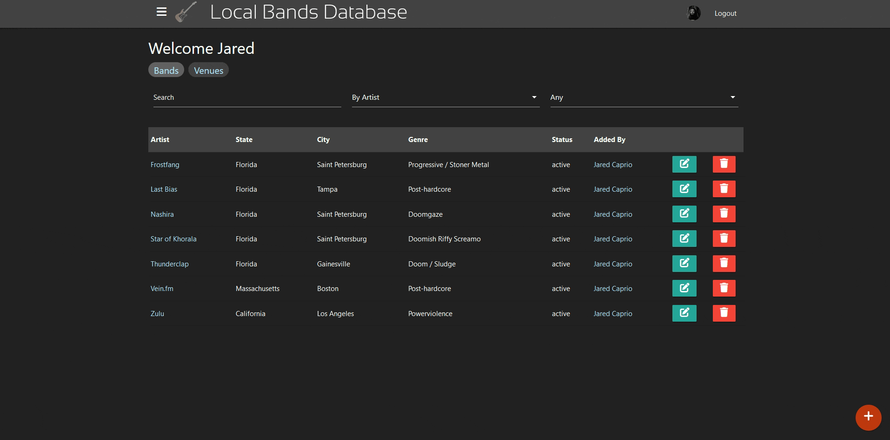
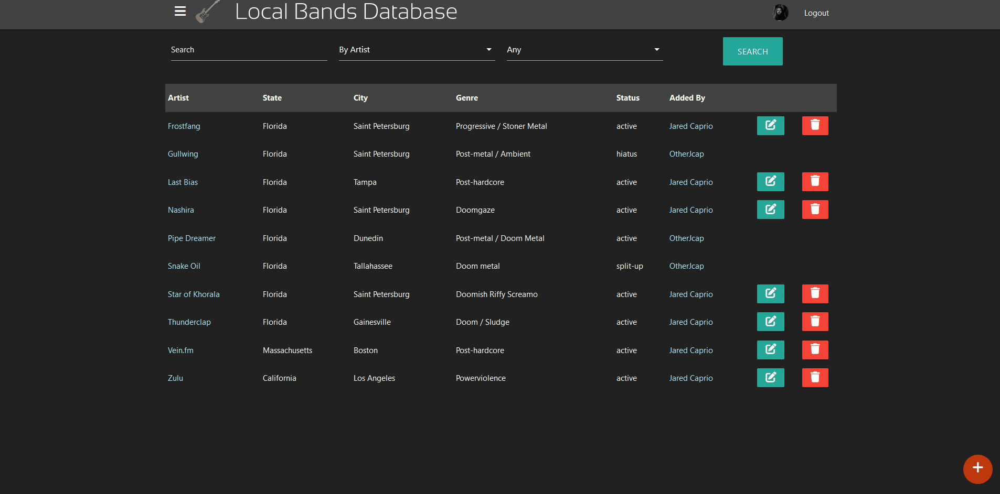
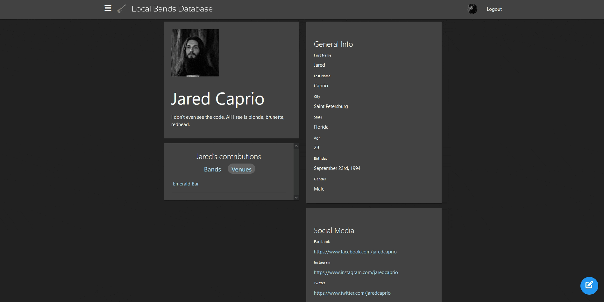

Welcome to the Local Bands Database, your gateway to exploring and contributing to your local music scene. This platform offers easy access via Google login, allowing users to share insights about local bands and venues. You can personalize your experience by creating user profiles, where you can showcase your musical preferences and contributions. Share details about the bands and venues in your area to help others discover hidden gems and rising talents. Explore the local music scene with our comprehensive search functionality, connecting with bands, venues, and fellow music enthusiasts effortlessly. Plus, create and curate personalized bandlists, filtering and organizing your musical discoveries to match your taste. Join us in celebrating the diverse sounds and talents in your local area and let's amplify local music together!

---

#### 📃View personal list of bands

#### 🎸 Add bands to the Database

## 

#### 👤 View and edit you profile

